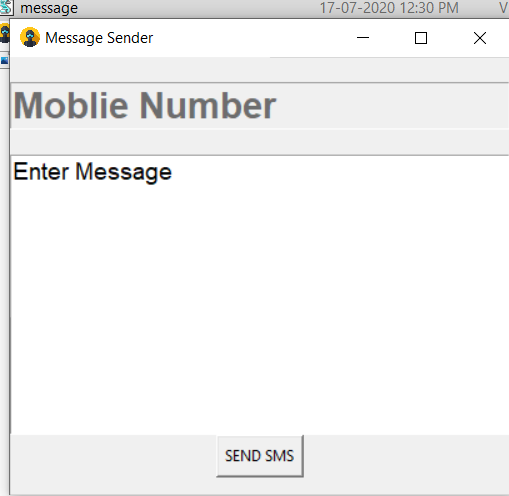

 

  

  <h3 align="center">✉ Message Sender Using python</h3>

  

      Message Sender is created using python and tkinter . To send the messages the api from fast2sms has been used...
     
    <a href="https://github.com/Abhayparashar31/Wikipedia-article-summrization/"><strong>Explore the Project »</strong></a>
     
     
    <a href="#">View Web Demo</a>
    ·
    <a>Report Bug -> parasharabhay13@gmail.com</a>
    
  

## Design
  
## Contributers

Abhayparashar31

<!-- LICENSE -->
## License

Distributed under the MIT License. See `LICENSE` for more information.

<!-- CONTACT -->
## Contact

Your Name - Abhayparashar31

Project Link: [https://github.com/Abhayparashar31/Wikipedia-article-summrization/](https://github.com/Abhayparashar31/Wikipedia-article-summrization/)

## References
* Stackoverflow
* Data flair
* Towards data science
